# A near real-world Dioxus web app with SQLite backend


<p align="center">
    <a href="https://dioxuslabs.com">
        
    </a>
    <br>
</p>

# Background

A full-stack application built with [Dioxus](https://dioxuslabs.com/) and SQLite, implementing a RealWorld blog platform.


Some time back I published [ Leptos ](https://leptos.dev/) Rust framework based full stack demo web application as part of my Rust learning exercises. In continuation to  that, I saw an opportunity to port the same application to the [ Dioxus ](https://dioxuslabs.com/), another Rust framework, that is also one of the leading one in the Rust front-end framework [list](https://github.com/flosse/rust-web-framework-comparison?tab=readme-ov-file#frontend-frameworks-wasm). 

In case anyone is interested in the above-mentioned Leptos demo app, it is available here:
1. [ realworld-app-leptos-axum sqlite ](https://github.com/santhosh7403/realworld-app-leptos-axum-sqlite) 
2. [ realworld-app-leptos-axum postgres ](https://github.com/santhosh7403/realworld-app-leptos-axum)

As before, I hope this project will serve as a valuable, hands-on example for anyone considering the Dioxus framework for their own project or wanting a peek into a more real-world working example.


To ensure it runs in a few simple steps, backend DB is in SQLite ([a practical choice for many apps that don't require heavy write operations](https://dev.to/shayy/everyone-is-wrong-about-sqlite-4gjf) ). Interested to see it? just clone the repo and follow the instructions below.

Before proceeding, you may take a look at the screenshots here. This will give you a quick glance at the app so you can decide.


This app includes:

- Dioxus
- axum
- SSR
- sqlite
- fts5
- Modal Windows
- argon2 (password encrypt)
- uuid
- tailwindcss
- fontawesome icons
- JWT


# Install and run

## Tools
Primarily you will need `rust` , `dioxus-cli`, `wasm32-unknown-unknown` and standard system dependencies.

1. Install Rust compiler and `stable` toolchain.

    Head over to https://rust-lang.org and install `rustup` (or install `rustup` via your OS specific package manager).Once `rustup` is installed, add the `stable` toolchain.

    ```
    rustup toolchain install stable
    ```

2. Install `wasm32-unknown-unknown` Rust target -  add the ability to compile Rust to WebAssembly

    ```
    rustup target add wasm32-unknown-unknown
    ```
3. Install `cargo-binstall` for installing a pre-built binary of `dioxus-cli` (next step). It is also possible to build the dioxus-cli from source, but be aware it may take several minutes (please refer to the link in the next step).

    ```
    cargo install cargo-binstall
    ```

4. Install `dioxus-cli` (forcing version 0.6.3, otherwise the latest stable will install). If you encounter any issues, Please refer [here.](https://dioxuslabs.com/learn/0.6/getting_started/#install-the-dioxus-cli)

    ```
    cargo binstall dioxus-cli
    ```


## Clone
Clone the repo.

```
git clone https://github.com/santhosh7403/realworld-app-dioxus-sqlite.git
cd realworld-app-dioxus-sqlite
```

## Database
Set the DATABASE_URL env variable

```
source .env
```
If you encounter any database issues, try the additional steps in this document [ README_DATABASE.md ](https://github.com/santhosh7403/realworld-app-dioxus-sqlite/blob/main/README_DATABASE.md) to initialize, drop, or recreate database.

## Run

You may now build and run the application:
```
dx serve
```
<details>
<summary>Click to view terminal output example</summary>

```bash
santhosh@fedora:~/my_github_repos/realworld-app-dioxus-sqlite$ dx serve
warning: Waiting for cargo-metadata...
15:03:09 [dev] -----------------------------------------------------------------
                Serving your app: realworld-app-dioxus-sqlite-dx-71! 🚀
                • Press `ctrl+c` to exit the server
                • Press `r` to rebuild the app
                • Press `p` to toggle automatic rebuilds
                • Press `v` to toggle verbose logging
                • Press `/` for more commands and shortcuts
                Learn more at https://dioxuslabs.com/learn/0.7/getting_started
               ---------------------------------------------------------------- 
15:05:44 [dev] Build completed successfully in 154624ms, launching app! 💫 
15:05:45 [server]  INFO Registering server function: POST /api/editor_action
15:05:45 [server]  INFO Registering server function: POST /api/search_fetch_results
15:05:45 [server]  INFO Registering server function: POST /api/delete_article
15:05:45 [server]  INFO Registering server function: POST /api/current_user
15:05:45 [server]  INFO Registering server function: POST /api/login
15:05:45 [server]  INFO Registering server function: POST /api/logout
15:05:45 [server]  INFO Registering server function: POST /api/signup_action9269776427574912722
15:05:45 [server]  INFO Registering server function: POST /api/delete_comment
15:05:45 [server]  INFO Registering server function: POST /api/get_comments
15:05:45 [server]  INFO Registering server function: POST /api/post_comment
15:05:45 [server]  INFO Registering server function: POST /api/get_article
15:05:45 [server]  INFO Registering server function: POST /api/follow_action
15:05:45 [server]  INFO Registering server function: POST /api/fav_action
15:05:45 [server]  INFO Registering server function: POST /api/reset_password_213529242004652721604
15:05:45 [server]  INFO Registering server function: POST /api/reset_password_1
15:05:45 [server]  INFO Registering server function: GET /api/settings_get
15:05:45 [server]  INFO Registering server function: POST /api/settings_update
15:05:45 [server]  INFO Registering server function: POST /api/get_tags10263263092093384903
15:05:45 [server]  INFO Registering server function: POST /api/home_articles
15:05:45 [server]  INFO Registering server function: POST /api/user_profile
15:05:45 [server]  INFO Registering server function: POST /api/profile_articles
15:05:58 [server]  INFO redirecting

╭────────────────────────────────────────────────────────────────────────────────────────── /:more ╮
│  App:     ━━━━━━━━━━━━━━━━━━━━━━━━━━  🎉 3.1s      Platform: Web + fullstack                     │
│  Server:  ━━━━━━━━━━━━━━━━━━━━━━━━━━  🎉 3.1s      App features: ["web"]                         │
│  Status:  Serving realworld-app-dioxus-sqlite 🚀   Serving at: http://127.0.0.1:8080             │
╰──────────────────────────────────────────────────────────────────────────────────────────────────╯

```
</details>

# Application access


Once application has started, access application from your web browser [ localhost:8080 ](http://localhost:8080/)

The application screen looks like this


More screenshots are [ available here ](https://github.com/santhosh7403/realworld-app-dioxus-sqlite/blob/main/App_Screenshots.md)


To showcase the app and test it out, some sample users and data are pre-populated. User names 'user1' to 'user5' are available and the password is same as the username. If you want to remove this data, you may delete the 'basedata' files inside the `./migrations` folder and setup database as explained in [DATABASE_README.md](https://github.com/santhosh7403/realworld-app-leptos-axum-sqlite/blob/main/README_DATABASE.md).

# Sqlite fts5 (full-text search)

The Full-Text Search feature covers three fields from the articles table. If you are interested in learning how it works or want to experiment with different search methods, please refer to the SQLite FTS5 documentation [ here ](https://www.sqlite.org/fts5.html#overview_of_fts5)


# Tailwind CSS

The styling of this application UI uses Tailwind CSS. Tailwind allows you to style your elements with CSS utility classes. The `tailwind.css` file in the project root folder links where the source files are located and the `tailwind.css` file in assets folder where the generated output CSS.

The output tailwind.css is generated from source CSS utility classes using a standalone Tailwind CSS CLI binary. there are other options available; please refer to this [link for other options.](https://dioxuslabs.com/learn/0.7/guides/utilities/tailwind)

The standalone Tailwind css utility can be downloaded from [here.](https://github.com/tailwindlabs/tailwindcss/releases)

```
santhosh@fedora:~/realworld-app-dioxus-sqlite$ ~/Downloads/tailwindcss-linux-x64 -i input.css -o assets/tailwind.css
≈ tailwindcss v4.1.17
```
**Note**: This step is only required if you are making any changes to CSS classes or adding/changing UI elements. Also, as of Dioxus 0.7, DX automatically detects if your project is using TailwindCSS if it finds a file called "tailwind.css" at the root of your project [reference document](https://dioxuslabs.com/learn/0.7/essentials/ui/styling#tailwind).

## 🏗️ Other Variants

If you are looking for this same application with different frameworks or databases, check out these versions:

| Framework | Database | Auth Type | Repository |
| :--- | :--- | :--- | :--- |
| **Dioxus** | SQLite | JWT | *This Repository* |
| **Dioxus** | SQLite | Session | [View Repo](https://github.com/santhosh7403/axum-session-auth=realworld-app-dioxus-sqlite) |
| **Leptos** | PostgreSQL | Session | [View Repo](https://github.com/santhosh7403/axum-session-auth-realworld-app-leptos-postgres)|
| **Leptos** | PostgreSQL | JWT | [View Repo](https://github.com/santhosh7403/realworld-app-leptos-axum) |
| **Leptos** | SQLite | JWT | [View Repo](https://github.com/santhosh7403/realworld-app-leptos-axum-sqlite) |

## 🙏 Inspiration and Acknowledgements

The foundational structure of this application is derived from the realworld example by [Bechma/realworld-leptos](https://github.com/Bechma/realworld-leptos), with appreciation to any antecedent projects.

This particular version was initiated during the transition from Leptos 0.6 to 0.7 and up as a personal learning exercise. It has since undergone significant experimentation and refinement, including:

*   A complete user interface redesign utilizing tailwindcss and fontawesome icons.

*   Implementation of modal windows and re-wired page navigation.

*   Integration of SQLite FTS5 for comprehensive full-text search capabilities.

*   An updated, non-reloading pagination method for search results.

*   Dark mode styling and user prefernce persistence.
